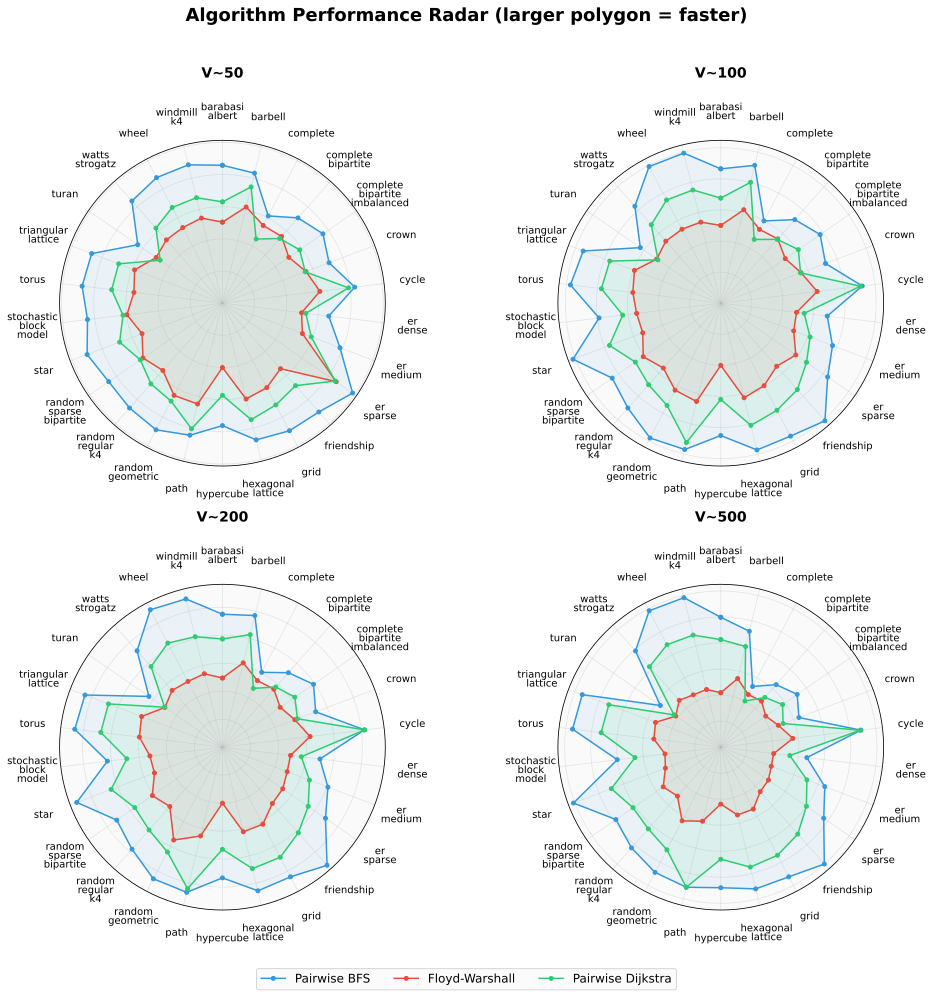
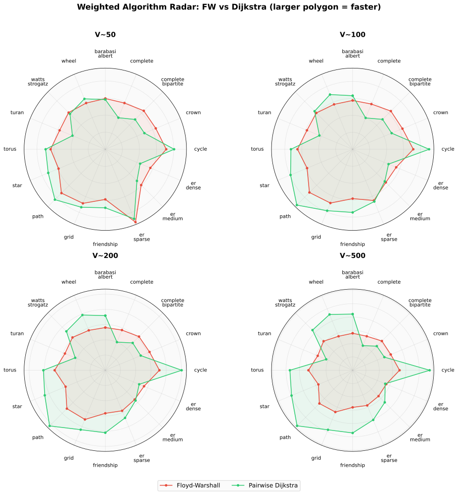
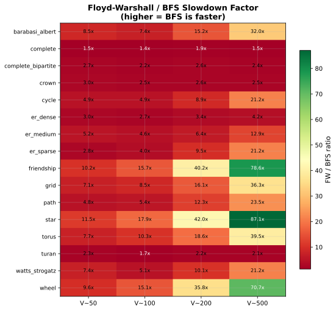
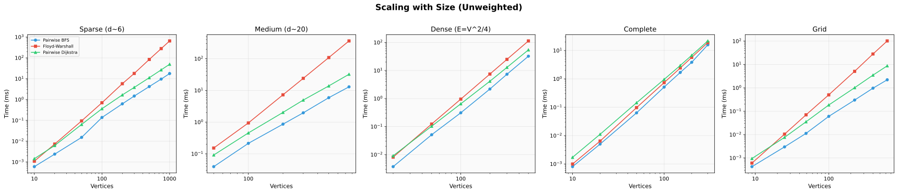
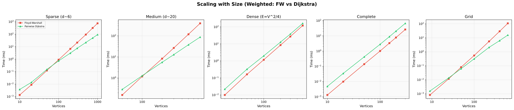
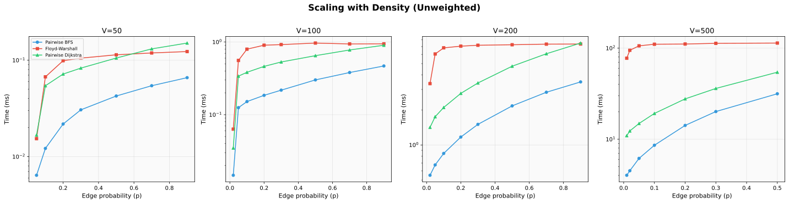
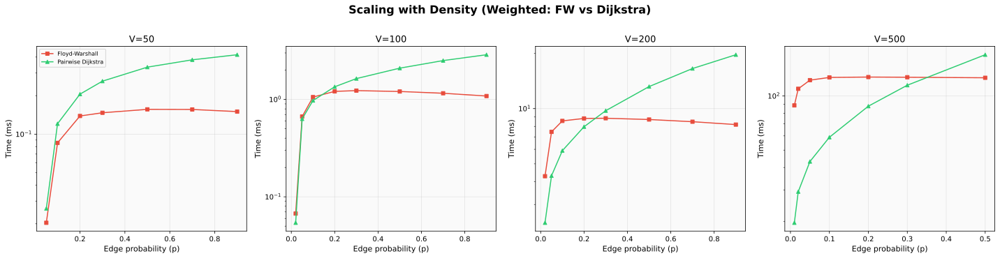
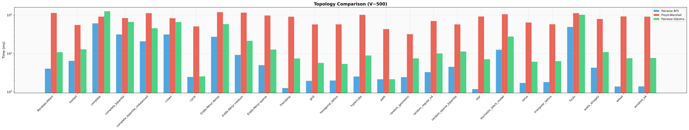
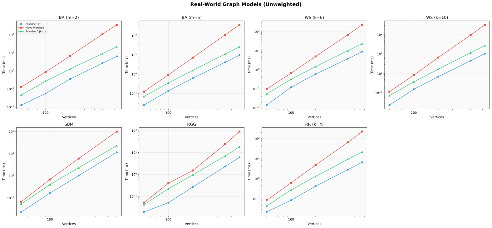
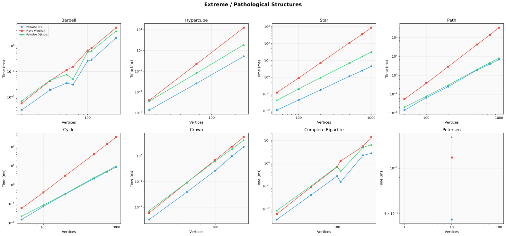

# All-Pairs Shortest Paths Benchmark

[](https://github.com/LucaCappelletti94/all-pairs-shortest-paths-benchmarks/actions/workflows/ci.yml)
[](https://github.com/LucaCappelletti94/all-pairs-shortest-paths-benchmarks/blob/main/LICENSE)

## Abstract

We benchmark three all-pairs shortest-path algorithms, Floyd-Warshall \[1,2\], Pairwise BFS \[3\], and Pairwise Dijkstra \[4\], from the [`geometric-traits`](https://github.com/earth-metabolome-initiative/geometric-traits) crate across 932 measurements in 47 benchmark groups. On unweighted graphs, Pairwise BFS is the fastest algorithm at every tested configuration, beating Floyd-Warshall by 1.2x on complete graphs and up to 183.7x on star graphs. On weighted graphs, there is a density-dependent crossover: Pairwise Dijkstra is faster on sparse graphs (up to 15.3x over Floyd-Warshall), while Floyd-Warshall wins on dense graphs (up to 2.4x faster on complete graphs at V=500). The weighted crossover occurs near edge probability p = 0.35 for V=500.

## Visual Summary

<p align="center">
  
</p>

Each axis represents a graph topology; a larger polygon means faster (log-scale). BFS (blue) envelops both FW (red) and Dijkstra (green) at all sizes. The gap widens from V=50 to V=500. The three density variants (er\_sparse, er\_medium, er\_dense) show the gap narrowing as density increases.

<p align="center">
  
</p>

In the weighted case, Dijkstra (green) is faster on sparse topologies (star, path, cycle) while Floyd-Warshall (red) wins on dense ones (complete, turan, er\_dense). The polygons cross over as density increases. At V=500 on er\_dense, FW wins by only 1.1x.

## Algorithms Overview

| Algorithm | Complexity | Graph Type | Method |
|:--|:--|:--|:--|
| Floyd-Warshall | O(V³) | Weighted | Dynamic programming over all vertex triples |
| Pairwise BFS | O(V · (V + E)) | Unweighted | Breadth-first search from each source vertex |
| Pairwise Dijkstra | O(V · (V + E) · log V) | Weighted (non-negative) | Dijkstra's algorithm from each source vertex |

**Floyd-Warshall** \[1,2\] considers every vertex as a potential intermediate stop. It requires O(V³) time regardless of edge count but benefits from cache-friendly sequential memory access.

**Pairwise BFS** \[3\] runs one BFS per source vertex. On sparse graphs where E = O(V), total cost is O(V²), which is asymptotically better than Floyd-Warshall. It requires unweighted edges.

**Pairwise Dijkstra** \[4\] runs Dijkstra's algorithm per source vertex. The binary-heap overhead adds a log V factor over BFS, but it handles arbitrary non-negative edge weights.

## Graph Types

### Classical Structures

- **Complete graph** K_n: n vertices, n(n-1)/2 edges, diameter 1
- **Cycle graph** C_n: n vertices, n edges, diameter ⌊n/2⌋
- **Path graph** P_n: n vertices, n-1 edges, diameter n-1
- **Star graph** S_n: n vertices, n-1 edges, diameter 2
- **Grid graph** G(r,c): r·c vertices, ~2rc edges, diameter r+c-2
- **Torus graph** T(r,c): r·c vertices, 2rc edges, diameter ⌊r/2⌋+⌊c/2⌋
- **Wheel graph** W_n: n+1 vertices, 2n edges, diameter 2

### Bipartite and Dense Structures

- **Crown graph** Crown(n): 2n vertices, n(n-1) edges, a bipartite complement of a perfect matching
- **Complete bipartite** K_{m,n}: m+n vertices, mn edges
- **Turan graph** T(n,r): n vertices, the densest graph without (r+1)-cliques

### Composite Structures

- **Barbell graph** B(k,p): two K_k cliques connected by a path of length p
- **Friendship graph** F_n: 2n+1 vertices, n triangles sharing a common vertex
- **Hypercube** Q_d: 2^d vertices, d·2^(d-1) edges

### Random Graph Models

- **Erdős-Rényi** G(n,p) \[5\]: each edge included independently with probability p
- **Barabási-Albert** BA(n,m) \[6\]: preferential attachment, produces scale-free networks
- **Watts-Strogatz** WS(n,k,β) \[7\]: ring lattice with random rewiring, produces small-world networks
- **Stochastic Block Model** SBM \[8\]: community structure with intra- and inter-community edge probabilities
- **Random Geometric** RGG(n,r): vertices placed uniformly in \[0,1\]², edges between points within distance r
- **Random Regular** RR(n,k): uniformly random k-regular graph

## Headline Results

The 12 largest speedup ratios observed across all 932 measurements:

| Graph | \|V\| | \|E\| | Faster | Slower | Winner | Speedup |
|:--|--:|--:|--:|--:|:--|--:|
| Star | 1,000 | 999 | **4.57 ms** (BFS) | 840 ms (FW) | BFS | **183.7x** |
| Star | 750 | 749 | **2.39 ms** (BFS) | 360 ms (FW) | BFS | **150.4x** |
| Star | 500 | 499 | **1.07 ms** (BFS) | 112 ms (FW) | BFS | **104.7x** |
| Star (topology) | 500 | 499 | **1.07 ms** (BFS) | 92.7 ms (FW) | BFS | **87.1x** |
| Friendship | 499 | 747 | **1.18 ms** (BFS) | 92.4 ms (FW) | BFS | **78.6x** |
| Wheel | 500 | 998 | **1.29 ms** (BFS) | 91.4 ms (FW) | BFS | **70.7x** |
| BA m=2 | 750 | 1,497 | **6.56 ms** (BFS) | 371 ms (FW) | BFS | **56.6x** |
| Grid | 625 | 1,200 | **2.21 ms** (BFS) | 102 ms (FW) | BFS | **46.0x** |
| Path | 1,000 | 999 | **7.18 ms** (BFS) | 325 ms (FW) | BFS | **45.2x** |
| Path (weighted) | 500 | 499 | **3.29 ms** (Dij) | 50.5 ms (FW) | Dijkstra | **15.3x** |
| Cycle (weighted) | 500 | 500 | **3.77 ms** (Dij) | 51.0 ms (FW) | Dijkstra | **13.5x** |
| Star (weighted) | 500 | 499 | **9.67 ms** (Dij) | 119 ms (FW) | Dijkstra | **12.3x** |

BFS accounts for the largest speedups because unweighted APSP is O(V(V+E)) vs O(V³). For weighted graphs, Dijkstra is up to 15.3x faster than Floyd-Warshall on sparse topologies.

<p align="center">
  
</p>

## Size Scaling

Performance as graph size increases at fixed density levels.

<p align="center">
  
</p>

### Sparse Random Graphs (d ~ 6)

Erdős-Rényi G(n, 3n), average degree approximately 6.

| \|V\| | \|E\| | BFS | FW | Dijkstra | Winner | Speedup |
|--:|--:|--:|--:|--:|:--|--:|
| 10 | 30 | **601 ns** | 1.10 us | 1.45 us | BFS | 2.4x |
| 20 | 60 | **2.40 us** | 7.29 us | 6.22 us | BFS | 3.0x |
| 50 | 150 | **15.3 us** | 94.6 us | 63.8 us | BFS | 6.2x |
| 100 | 300 | **138 us** | 703 us | 364 us | BFS | 5.1x |
| 200 | 600 | **622 us** | 5.75 ms | 1.67 ms | BFS | 9.2x |
| 300 | 900 | **1.47 ms** | 18.0 ms | 3.83 ms | BFS | 12.2x |
| 500 | 1,500 | **4.20 ms** | 84.0 ms | 11.2 ms | BFS | 20.0x |
| 750 | 2,250 | **9.59 ms** | 278 ms | 26.6 ms | BFS | 29.0x |
| 1,000 | 3,000 | **17.7 ms** | 651 ms | 49.5 ms | BFS | 36.8x |

BFS is faster at all sizes tested. The gap grows with V because FW is O(V³) while BFS is O(V(V+E)) = O(V²) for fixed average degree.

### Medium Random Graphs (d ~ 20)

Erdős-Rényi G(n, 10n), average degree approximately 20.

| \|V\| | \|E\| | BFS | FW | Dijkstra | Winner | Speedup |
|--:|--:|--:|--:|--:|:--|--:|
| 50 | 500 | **39.5 us** | 153 us | 91.8 us | BFS | 3.9x |
| 100 | 1,000 | **214 us** | 944 us | 456 us | BFS | 4.4x |
| 200 | 2,000 | **864 us** | 7.28 ms | 2.03 ms | BFS | 8.4x |
| 300 | 3,000 | **1.97 ms** | 24.0 ms | 4.97 ms | BFS | 12.2x |
| 500 | 5,000 | **5.90 ms** | 109 ms | 13.9 ms | BFS | 18.4x |
| 750 | 7,500 | **13.0 ms** | 364 ms | 32.4 ms | BFS | 28.0x |

### Dense Random Graphs (E = V²/4)

Erdős-Rényi G(n, n²/4), edge count proportional to V².

| \|V\| | \|E\| | BFS | FW | Dijkstra | Winner | Speedup |
|--:|--:|--:|--:|--:|:--|--:|
| 20 | 100 | **3.73 us** | 8.12 us | 9.09 us | BFS | 2.4x |
| 50 | 625 | **51.2 us** | 123 us | 103 us | BFS | 2.4x |
| 100 | 2,500 | **310 us** | 954 us | 648 us | BFS | 3.1x |
| 200 | 10,000 | **2.19 ms** | 7.48 ms | 4.15 ms | BFS | 3.4x |
| 300 | 22,500 | **7.35 ms** | 24.9 ms | 12.9 ms | BFS | 3.4x |
| 500 | 62,500 | **32.3 ms** | 113 ms | 54.4 ms | BFS | 3.5x |

At half-density, BFS is still 3-4x faster than FW. The gap stabilizes because both algorithms approach O(V³).

### Complete Graphs

K_n, the densest possible graph.

| \|V\| | \|E\| | BFS | FW | Dijkstra | Winner | Speedup |
|--:|--:|--:|--:|--:|:--|--:|
| 10 | 45 | **806 ns** | 995 ns | 1.72 us | BFS | 2.1x |
| 20 | 190 | **5.03 us** | 6.43 us | 11.2 us | BFS | 2.2x |
| 50 | 1,225 | **63.4 us** | 96.9 us | 144 us | BFS | 2.3x |
| 100 | 4,950 | **514 us** | 737 us | 959 us | BFS | 1.9x |
| 150 | 11,175 | **1.69 ms** | 2.42 ms | 2.96 ms | BFS | 1.8x |
| 200 | 19,900 | **3.83 ms** | 5.72 ms | 6.78 ms | BFS | 1.8x |
| 300 | 44,850 | **15.9 ms** | 19.0 ms | 21.7 ms | BFS | 1.4x |

On complete graphs, BFS is 1.4-2.3x faster than FW. This is the tightest race: E = V(V-1)/2 makes BFS cost O(V(V+E)) = O(V³), matching FW's complexity class. BFS still wins because it has simpler per-operation overhead (no distance addition or comparison).

### Grid Graphs

G(k,k), k × k grid with ~2k² edges.

| \|V\| | \|E\| | BFS | FW | Dijkstra | Winner | Speedup |
|--:|--:|--:|--:|--:|:--|--:|
| 9 | 12 | **425 ns** | 603 ns | 945 ns | BFS | 2.2x |
| 25 | 40 | **2.98 us** | 10.4 us | 7.61 us | BFS | 3.5x |
| 49 | 84 | **11.2 us** | 69.9 us | 35.2 us | BFS | 6.2x |
| 100 | 180 | **60.2 us** | 502 us | 185 us | BFS | 8.3x |
| 225 | 420 | **301 us** | 5.10 ms | 1.01 ms | BFS | 17.0x |
| 400 | 760 | **970 us** | 28.1 ms | 3.51 ms | BFS | 29.0x |
| 625 | 1,200 | **2.21 ms** | 102 ms | 8.75 ms | BFS | 46.0x |

### Weighted Size Scaling (FW vs Dijkstra)

<p align="center">
  
</p>

On weighted sparse graphs, Dijkstra is 8.0x faster at V=1000 (sparse d6). On weighted complete graphs, FW wins at all tested sizes: 3.7x at V=10, narrowing to 2.5x at V=300.

## Density Scaling

Performance as edge density increases at fixed vertex count.

<p align="center">
  
</p>

### V = 50

| p | \|E\| | BFS | FW | Dijkstra | FW/BFS |
|--:|--:|--:|--:|--:|--:|
| 0.05 | 46 | **6.41 us** | 15.4 us | 16.7 us | 2.4x |
| 0.1 | 111 | **12.2 us** | 67.2 us | 54.4 us | 5.5x |
| 0.2 | 227 | **21.8 us** | 98.9 us | 71.9 us | 4.5x |
| 0.3 | 349 | **30.6 us** | 105 us | 82.9 us | 3.4x |
| 0.5 | 587 | **42.6 us** | 114 us | 105 us | 2.7x |
| 0.7 | 847 | **54.4 us** | 119 us | 131 us | 2.2x |
| 0.9 | 1,099 | **66.0 us** | 123 us | 151 us | 1.9x |

### V = 100

| p | \|E\| | BFS | FW | Dijkstra | FW/BFS |
|--:|--:|--:|--:|--:|--:|
| 0.02 | 80 | **14.7 us** | 63.3 us | 34.8 us | 4.3x |
| 0.05 | 227 | **125 us** | 557 us | 339 us | 4.5x |
| 0.1 | 465 | **152 us** | 797 us | 383 us | 5.3x |
| 0.2 | 956 | **185 us** | 904 us | 462 us | 4.9x |
| 0.3 | 1,472 | **218 us** | 921 us | 531 us | 4.2x |
| 0.5 | 2,496 | **301 us** | 967 us | 649 us | 3.2x |
| 0.7 | 3,478 | **381 us** | 940 us | 777 us | 2.5x |
| 0.9 | 4,477 | **468 us** | 944 us | 902 us | 2.0x |

### V = 200

| p | \|E\| | BFS | FW | Dijkstra | FW/BFS |
|--:|--:|--:|--:|--:|--:|
| 0.02 | 367 | **549 us** | 3.37 ms | 1.42 ms | 6.1x |
| 0.05 | 956 | **674 us** | 6.05 ms | 1.75 ms | 9.0x |
| 0.1 | 2,002 | **846 us** | 6.83 ms | 2.10 ms | 8.1x |
| 0.2 | 4,009 | **1.17 ms** | 7.06 ms | 2.78 ms | 6.0x |
| 0.3 | 5,996 | **1.50 ms** | 7.19 ms | 3.41 ms | 4.8x |
| 0.5 | 9,967 | **2.17 ms** | 7.26 ms | 4.75 ms | 3.4x |
| 0.7 | 13,966 | **2.84 ms** | 7.35 ms | 6.08 ms | 2.6x |
| 0.9 | 17,913 | **3.48 ms** | 7.36 ms | 7.51 ms | 2.1x |

### V = 500

| p | \|E\| | BFS | FW | Dijkstra | FW/BFS |
|--:|--:|--:|--:|--:|--:|
| 0.01 | 1,234 | **4.02 ms** | 77.5 ms | 10.9 ms | 19.3x |
| 0.02 | 2,520 | **4.51 ms** | 94.8 ms | 12.3 ms | 21.0x |
| 0.05 | 6,246 | **6.16 ms** | 106 ms | 14.9 ms | 17.2x |
| 0.1 | 12,524 | **8.59 ms** | 110 ms | 19.2 ms | 12.9x |
| 0.2 | 25,129 | **14.2 ms** | 111 ms | 27.7 ms | 7.8x |
| 0.3 | 37,569 | **20.1 ms** | 113 ms | 36.1 ms | 5.6x |
| 0.5 | 62,592 | **31.6 ms** | 114 ms | 54.4 ms | 3.6x |

FW time is constant with respect to density (O(V³) always), while BFS and Dijkstra cost grows with E. At p=0.9 (near-complete), BFS is still 1.9-2.1x faster than FW at all tested sizes.

### Weighted Density Scaling (FW vs Dijkstra)

<p align="center">
  
</p>

At V=500 with random weights in \[1, 9\]:

| p | FW | Dijkstra | Winner | Speedup |
|--:|--:|--:|:--|--:|
| 0.01 | 85.6 ms | **18.8 ms** | Dijkstra | 4.5x |
| 0.02 | 105 ms | **28.0 ms** | Dijkstra | 3.7x |
| 0.05 | 117 ms | **41.2 ms** | Dijkstra | 2.8x |
| 0.10 | 121 ms | **55.9 ms** | Dijkstra | 2.2x |
| 0.20 | 121 ms | **82.9 ms** | Dijkstra | 1.5x |
| 0.30 | 121 ms | **109 ms** | Dijkstra | 1.1x |
| 0.50 | **120 ms** | 162 ms | FW | 1.4x |

The crossover is between p=0.30 and p=0.50 (roughly p=0.35). Below this density, Dijkstra's O(V(V+E) log V) is faster because E is small enough to offset the per-source overhead. Above it, FW's O(V³) with no heap operations wins.

## Topology Comparison

Performance across 16 graph topologies at fixed vertex count.

### V ~ 500 (Unweighted)

| Topology | \|V\| | \|E\| | BFS | FW | Dijkstra | FW/BFS |
|:--|--:|--:|--:|--:|--:|--:|
| star | 500 | 499 | **1.07 ms** | 92.7 ms | 7.32 ms | 87.1x |
| friendship | 499 | 747 | **1.18 ms** | 92.4 ms | 7.33 ms | 78.6x |
| wheel | 500 | 998 | **1.29 ms** | 91.4 ms | 7.60 ms | 70.7x |
| torus | 506 | 1,012 | **1.52 ms** | 60.1 ms | 6.42 ms | 39.5x |
| grid | 506 | 967 | **1.48 ms** | 53.8 ms | 6.23 ms | 36.3x |
| barabasi\_albert | 500 | 1,494 | **3.49 ms** | 112 ms | 10.7 ms | 32.0x |
| path | 500 | 499 | **1.81 ms** | 42.4 ms | 2.10 ms | 23.5x |
| cycle | 500 | 500 | **2.25 ms** | 47.9 ms | 2.47 ms | 21.2x |
| er\_sparse | 500 | 2,520 | **4.55 ms** | 96.4 ms | 12.5 ms | 21.2x |
| watts\_strogatz | 500 | 1,500 | **3.85 ms** | 81.8 ms | 10.8 ms | 21.2x |
| er\_medium | 500 | 12,524 | **8.67 ms** | 112 ms | 19.3 ms | 12.9x |
| er\_dense | 500 | 50,015 | **26.9 ms** | 114 ms | 46.0 ms | 4.2x |
| crown | 500 | 62,250 | **31.2 ms** | 78.2 ms | 54.5 ms | 2.5x |
| complete\_bipartite | 500 | 62,500 | **32.0 ms** | 76.8 ms | 54.3 ms | 2.4x |
| turan | 500 | 100,000 | **49.2 ms** | 104 ms | 81.2 ms | 2.1x |
| complete | 500 | 124,750 | **60.4 ms** | 92.0 ms | 99.5 ms | 1.5x |

The FW/BFS ratio ranges from 1.5x on complete graphs to 87.1x on star graphs (two orders of magnitude). The ratio correlates with edge density: sparse topologies (star, friendship, wheel) show the largest gaps, dense topologies (complete, turan) the smallest.

### V ~ 500 (Weighted: FW vs Dijkstra)

| Topology | \|V\| | \|E\| | FW | Dijkstra | Winner | Speedup |
|:--|--:|--:|--:|--:|:--|--:|
| path | 500 | 499 | 50.5 ms | **3.29 ms** | Dijkstra | 15.3x |
| cycle | 500 | 500 | 51.0 ms | **3.77 ms** | Dijkstra | 13.5x |
| star | 500 | 499 | 119 ms | **9.67 ms** | Dijkstra | 12.3x |
| friendship | 499 | 747 | 119 ms | **13.0 ms** | Dijkstra | 9.2x |
| wheel | 500 | 998 | 122 ms | **15.9 ms** | Dijkstra | 7.7x |
| grid | 506 | 967 | 58.9 ms | **11.2 ms** | Dijkstra | 5.3x |
| barabasi\_albert | 500 | 1,494 | 120 ms | **22.8 ms** | Dijkstra | 5.3x |
| torus | 506 | 1,012 | 64.3 ms | **12.9 ms** | Dijkstra | 5.0x |
| er\_sparse | 500 | 2,520 | 109 ms | **28.3 ms** | Dijkstra | 3.9x |
| watts\_strogatz | 500 | 1,500 | 84.0 ms | **21.7 ms** | Dijkstra | 3.9x |
| er\_medium | 500 | 12,524 | 124 ms | **58.0 ms** | Dijkstra | 2.1x |
| er\_dense | 500 | 50,015 | **127 ms** | 140 ms | FW | 1.1x |
| crown | 500 | 62,250 | **83.2 ms** | 151 ms | FW | 1.8x |
| complete\_bipartite | 500 | 62,500 | **82.4 ms** | 154 ms | FW | 1.9x |
| turan | 500 | 100,000 | **112 ms** | 247 ms | FW | 2.2x |
| complete | 500 | 124,750 | **122 ms** | 294 ms | FW | 2.4x |

Dijkstra wins on 11 of 16 topologies. FW wins on the 5 densest: complete, turan, complete\_bipartite, crown, and er\_dense (p=0.4). The breakeven is near 50,000 edges for V=500 (edge density ~40%).

<p align="center">
  
</p>

## Real-World Graph Models

<p align="center">
  
</p>

### Barabási-Albert (m = 2)

Scale-free network with preferential attachment, average degree ~4.

| \|V\| | \|E\| | BFS | FW | Dijkstra | FW/BFS |
|--:|--:|--:|--:|--:|--:|
| 50 | 97 | **13.6 us** | 97.3 us | 48.3 us | 7.2x |
| 100 | 197 | **59.2 us** | 575 us | 187 us | 9.7x |
| 200 | 397 | **285 us** | 4.94 ms | 951 us | 17.3x |
| 500 | 997 | **2.74 ms** | 111 ms | 9.15 ms | 40.5x |
| 750 | 1,497 | **6.56 ms** | 371 ms | 21.2 ms | 56.6x |

### Watts-Strogatz (k = 6, beta = 0.3)

Small-world network with ring lattice and random rewiring.

| \|V\| | \|E\| | BFS | FW | Dijkstra | FW/BFS |
|--:|--:|--:|--:|--:|--:|
| 50 | 150 | **16.5 us** | 102 us | 56.7 us | 6.2x |
| 100 | 300 | **61.9 us** | 531 us | 183 us | 8.6x |
| 200 | 600 | **290 us** | 4.37 ms | 920 us | 15.1x |
| 500 | 1,500 | **3.26 ms** | 79.5 ms | 9.92 ms | 24.4x |
| 750 | 2,250 | **7.51 ms** | 270 ms | 23.3 ms | 36.0x |

### Stochastic Block Model

Community structure with p\_intra=0.3, p\_inter=0.01.

| \|V\| | \|E\| | BFS | FW | Dijkstra | FW/BFS |
|--:|--:|--:|--:|--:|--:|
| 50 | 198 | **17.1 us** | 78.2 us | 51.7 us | 4.6x |
| 100 | 817 | **85.2 us** | 555 us | 228 us | 6.5x |
| 200 | 3,119 | **518 us** | 4.47 ms | 1.33 ms | 8.6x |
| 500 | 19,221 | **11.0 ms** | 109 ms | 21.6 ms | 9.9x |

## Extreme and Pathological Cases

<p align="center">
  
</p>

### Star Graphs

Largest BFS advantage observed. Every BFS from a leaf reaches all other vertices in at most 2 hops, while FW still performs V³ operations.

| \|V\| | \|E\| | BFS | FW | Dijkstra | FW/BFS |
|--:|--:|--:|--:|--:|--:|
| 50 | 49 | **11.0 us** | 139 us | 68.1 us | 12.7x |
| 100 | 99 | **40.2 us** | 736 us | 227 us | 18.3x |
| 200 | 199 | **172 us** | 7.02 ms | 993 us | 40.8x |
| 500 | 499 | **1.07 ms** | 112 ms | 8.01 ms | 104.7x |
| 750 | 749 | **2.39 ms** | 360 ms | 18.3 ms | 150.4x |
| 1,000 | 999 | **4.57 ms** | 840 ms | 30.3 ms | 183.7x |

### Path Graphs

Maximum diameter (V-1), the worst case for BFS queue depth.

| \|V\| | \|E\| | BFS | FW | Dijkstra | FW/BFS |
|--:|--:|--:|--:|--:|--:|
| 50 | 49 | **11.4 us** | 47.2 us | 22.3 us | 4.1x |
| 100 | 99 | **52.3 us** | 393 us | 114 us | 7.5x |
| 200 | 199 | **259 us** | 3.40 ms | 589 us | 13.1x |
| 500 | 499 | **1.82 ms** | 43.8 ms | 3.71 ms | 24.1x |
| 750 | 749 | **4.22 ms** | 150 ms | 8.90 ms | 35.5x |
| 1,000 | 999 | **7.18 ms** | 325 ms | 16.3 ms | 45.2x |

### Hypercube Graphs

Q_d has 2^d vertices and d·2^(d-1) edges, d-regular with logarithmic diameter.

| d | \|V\| | \|E\| | BFS | FW | Dijkstra | FW/BFS |
|--:|--:|--:|--:|--:|--:|--:|
| 4 | 16 | 32 | **1.34 us** | 3.55 us | 3.29 us | 2.6x |
| 6 | 64 | 192 | **20.9 us** | 172 us | 77.7 us | 8.2x |
| 8 | 256 | 1,024 | **463 us** | 13.5 ms | 2.39 ms | 29.2x |

## Crossover Analysis

### Unweighted: BFS Always Wins

Across all 932 measurements, BFS is faster than Floyd-Warshall in every unweighted configuration tested. The minimum BFS advantage is 1.2x on complete graphs at V=300. BFS's lower constant factor (no distance addition or comparison, just a queue push) is enough to beat FW even when both algorithms perform O(V³) work on complete graphs.

### Weighted: Density-Dependent Crossover

For weighted graphs, Floyd-Warshall beats Dijkstra only on dense graphs. At V=500:

| Topology Class | Avg Degree | FW/Dijkstra | Winner |
|:--|--:|--:|:--|
| Path / Cycle | 2 | 13-15x | Dijkstra |
| Star | 2 | 12.3x | Dijkstra |
| Grid / Torus | ~4 | 5.0-5.3x | Dijkstra |
| BA m=3 / WS k=6 | 6 | 3.9-5.3x | Dijkstra |
| ER p=0.1 | ~50 | 2.1x | Dijkstra |
| ER p=0.4 (dense) | ~200 | 0.91x | FW |
| Crown / K\_{m,n} | ~250 | 0.54-0.55x | FW |
| Turan T(500,5) | 400 | 0.45x | FW |
| Complete K\_500 | 499 | 0.41x | FW |

The crossover depends on both edge count and the log V factor in Dijkstra's heap operations. As E grows, Dijkstra's per-source O((V+E)·log V) exceeds FW's per-vertex O(V²), making FW preferable above ~50,000 edges (40% density) for V=500.

## Methodology

- **Framework:** [Criterion.rs](https://github.com/bheisler/criterion.rs) 0.8 with HTML reports
- **Timing:** Mean of adaptive sample sizes (10-100 iterations, 10-120s measurement time depending on graph size)
- **Graph representation:** `SymmetricCSR2D<CSR2D<usize, usize, usize>>` from `geometric-traits`
- **Weighted view:** `GenericImplicitValuedMatrix2D` with deterministic weight function producing values in \[1, 9\]
- **Random seed:** All random graphs seeded with `42` for reproducibility
- **Compilation:** `--release` profile (optimized), single-threaded

### Benchmark Suites

| Suite | Groups | Measurements | Focus |
|:--|--:|--:|:--|
| `scaling_with_size` | 10 | 175 | Fixed density, varying vertex count |
| `scaling_with_density` | 8 | 150 | Fixed vertices, varying edge probability |
| `topology_comparison` | 8 | 320 | All graph types at fixed size (unweighted + weighted) |
| `realworld_structures` | 14 | 170 | Network science graph models |
| `extreme_cases` | 7 | 117 | Pathological and structured graphs |
| **Total** | **47** | **932** | |

### Adaptive Sampling

| \|V\| | Sample Size | Measurement Time |
|--:|--:|--:|
| >= 500 | 10 | 120 s |
| >= 200 | 10 | 60 s |
| >= 50 | 30 | 20 s |
| < 50 | 100 | 10 s |

## Reproducing

```bash
# Run all benchmarks (~12-15 hours)
cargo bench

# Run a single benchmark suite
cargo bench --bench topology_comparison

# Generate visualization plots
uv run --isolated --with matplotlib --with numpy python scripts/generate_plots.py
```

CI performs two lighter-weight checks: `cargo bench --benches --no-run` to verify optimized benchmark targets compile, and `cargo test --benches` to smoke-test the Criterion suites without running the full statistical benchmark job.

Results are stored in `target/criterion/` with HTML reports viewable at `target/criterion/report/index.html`.

## References

\[1\] R. W. Floyd, "Algorithm 97: Shortest Path," *Communications of the ACM*, vol. 5, no. 6, p. 345, 1962. [doi:10.1145/367766.368168](https://doi.org/10.1145/367766.368168)

\[2\] S. Warshall, "A Theorem on Boolean Matrices," *Journal of the ACM*, vol. 9, no. 1, pp. 11-12, 1962. [doi:10.1145/321105.321107](https://doi.org/10.1145/321105.321107)

\[3\] E. F. Moore, "The Shortest Path Through a Maze," *Proceedings of the International Symposium on the Theory of Switching*, pp. 285-292, 1959.

\[4\] E. W. Dijkstra, "A Note on Two Problems in Connexion with Graphs," *Numerische Mathematik*, vol. 1, pp. 269-271, 1959. [doi:10.1007/BF01386390](https://doi.org/10.1007/BF01386390)

\[5\] P. Erdős and A. Rényi, "On Random Graphs I," *Publicationes Mathematicae Debrecen*, vol. 6, pp. 290-297, 1959.

\[6\] A.-L. Barabási and R. Albert, "Emergence of Scaling in Random Networks," *Science*, vol. 286, no. 5439, pp. 509-512, 1999. [doi:10.1126/science.286.5439.509](https://doi.org/10.1126/science.286.5439.509)

\[7\] D. J. Watts and S. H. Strogatz, "Collective Dynamics of 'Small-World' Networks," *Nature*, vol. 393, pp. 440-442, 1998. [doi:10.1038/30918](https://doi.org/10.1038/30918)

\[8\] P. W. Holland, K. B. Laskey, and S. Leinhardt, "Stochastic Blockmodels: First Steps," *Social Networks*, vol. 5, no. 2, pp. 109-137, 1983. [doi:10.1016/0378-8733(83)90021-7](https://doi.org/10.1016/0378-8733(83)90021-7)
