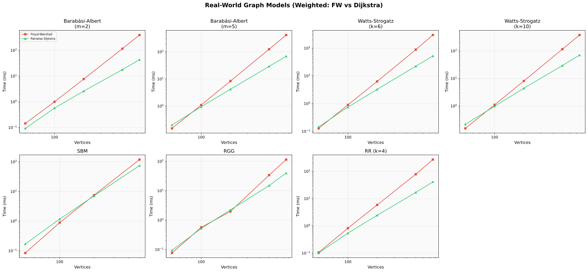
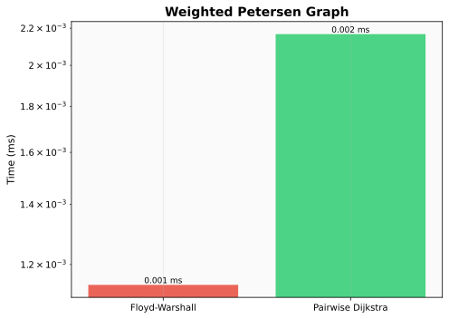

# All-Pairs Shortest Paths Benchmark

[](https://github.com/LucaCappelletti94/all-pairs-shortest-paths-benchmarks/actions/workflows/ci.yml)
[](https://github.com/LucaCappelletti94/all-pairs-shortest-paths-benchmarks/blob/main/LICENSE)

## Abstract

We benchmark three all-pairs shortest-path algorithms, Floyd-Warshall \[1,2\], Pairwise BFS \[3\], and Pairwise Dijkstra \[4\], from the [`geometric-traits`](https://github.com/earth-metabolome-initiative/geometric-traits) crate across **1,137 measurements in 49 benchmark groups**. Using Criterion mean point estimates, Pairwise BFS is fastest in all but one unweighted configuration, spanning dense complete graphs and sparse windmill, lattice, and random-regular families; the sole point-estimate exception is `cycle_V200`, where Pairwise Dijkstra is ahead by less than 1%. One additional case, `path_V500`, has overlapping marginal confidence intervals for BFS and Dijkstra, so it is not cleanly separable from Criterion's reported intervals alone. The largest measured speedup is **195.0x** on a 1,000-node star graph. On weighted graphs, point-estimate winners are both density- and size-dependent: at larger tested sizes Pairwise Dijkstra wins the sparse and medium-density cases, while Floyd-Warshall still wins the densest regimes; at `V=50`, however, Floyd-Warshall wins every sampled weighted density. These conclusions are specific to the `geometric-traits` implementations, graph representation, deterministic weighting scheme, sampled generator seeds, and host environment described below. At `V~500`, Dijkstra is the point-estimate winner on **21 of 26** topology families, while Floyd-Warshall wins the five densest cases: complete, complete bipartite, crown, dense Erdős-Rényi, and Turán.

## Visual Summary

<p align="center">
  
</p>

The unweighted radar is strongly BFS-favored. At `V~200`, `cycle` slightly favors Dijkstra by point estimate; at `V~500`, `path` is a near-tie whose BFS and Dijkstra marginal confidence intervals overlap. The newly added structured families, especially `windmill_k4`, `hexagonal_lattice`, `triangular_lattice`, and `hypercube`, preserve the broader BFS-favored pattern.

<p align="center">
  
</p>

The weighted radar shows a clear sparse-versus-dense split. At `V~500`, Dijkstra is the point-estimate winner on 21 of 26 topology families, including the tested path-like, lattice, windmill, wheel, friendship, and Barabási-Albert cases, while Floyd-Warshall is the point-estimate winner on the dense complete, multipartite, and dense random cases.

## Algorithms Overview

| Algorithm | Complexity | Graph Type | Method |
|:--|:--|:--|:--|
| Floyd-Warshall | O(V³) | Weighted | Dynamic programming over all vertex triples |
| Pairwise BFS | O(V · (V + E)) | Unweighted | Breadth-first search from each source vertex |
| Pairwise Dijkstra | O(V · (V + E) · log V) | Weighted (non-negative) | Dijkstra's algorithm from each source vertex |

**Floyd-Warshall** \[1,2\] considers every vertex as an intermediate pivot. Its runtime is independent of sparsity, which makes it predictable and competitive once graphs become very dense.

**Pairwise BFS** \[3\] runs one BFS per source. On sparse unweighted graphs it is asymptotically better than Floyd-Warshall.

**Pairwise Dijkstra** \[4\] runs Dijkstra from each source and supports non-negative edge weights.

## Graph Families

### Structured / Classical

- **Complete graph** `K_n`: `n` vertices, `n(n-1)/2` edges, diameter `1`
- **Path graph** `P_n`: `n` vertices, `n-1` edges, diameter `n-1`
- **Cycle graph** `C_n`: `n` vertices, `n` edges, diameter `⌊n/2⌋`
- **Star graph** `S_n`: `n` vertices, `n-1` edges, diameter `2`
- **Wheel graph** `W_n`: `n+1` vertices, `2n` edges, diameter `2`
- **Grid graph** `G(r,c)`: `r·c` vertices, roughly `2rc-r-c` edges
- **Torus graph** `T(r,c)`: `r·c` vertices, `2rc` edges
- **Hexagonal lattice**: benzenoid-style fused-hexagon lattice
- **Triangular lattice**: grid with alternating diagonals
- **Hypercube** `Q_d`: `2^d` vertices, `d·2^(d-1)` edges
- **Petersen graph**: fixed 10-vertex, 15-edge canonical cubic graph
- **Turán graph** `T(n,r)`: densest graph with no `(r+1)`-clique
- **Friendship graph** `F_n`: `2n+1` vertices, `n` triangles sharing one hub
- **Windmill K4**: `n` copies of `K4` glued at one shared hub vertex
- **Barbell graph** `B(k,p)`: two `K_k` cliques connected by a bridge with `p` intermediate vertices in the benchmark convention (`|V| = 2k + p`)

### Bipartite / Multipartite

- **Complete bipartite** `K_{m,n}`
- **Imbalanced complete bipartite**: `K_{m,n}` with strongly skewed partitions
- **Crown graph**: `K_{n,n}` minus a perfect matching
- **Random sparse bipartite**: two blocks with zero intra-block probability and sparse inter-block connectivity

### Random / Model Families

- **Erdős-Rényi `G(n,m)`** \[5\]: fixed edge budget, used for size scaling
- **Erdős-Rényi `G(n,p)`** \[5\]: fixed edge probability, used for density and topology comparisons
- **Barabási-Albert** \[6\]: preferential attachment
- **Watts-Strogatz** \[7\]: small-world rewired ring lattice
- **Stochastic block model** \[8\]: planted community structure
- **Random geometric graph**: Euclidean locality in `[0,1]^2`
- **Random regular `k=4`**: uniform degree-4 random graph

Together, these families vary several structural axes that are plausible APSP performance drivers: density, degree regularity, geometric locality, bipartite/community structure, and network-science generative models. The suite is broad rather than exhaustive; the aim is to expose one implementation stack to qualitatively different shortest-path workloads under a consistent representation and benchmark harness.

## Study Goals

- **Size scaling:** measure how runtime changes with graph order under fixed sparse, medium, dense, complete, and grid-like regimes.
- **Density scaling:** locate sparse-versus-dense crossover behavior at fixed graph order as edge probability increases.
- **Topology comparison:** compare natural generator families at the same rough problem scale, even when exact order matching is impossible for some discrete constructions.
- **Real-world models:** compare common network-generator families under sparse-to-medium parameter settings that stay within their typical operating regimes.
- **Extreme cases:** stress the implementations with deliberately pathological or highly symmetric structures rather than everyday workloads.

## Headline Results

Unless noted otherwise, the tables below report Criterion mean point estimates from `target/criterion/**/new/estimates.json`.

The 12 largest measured slowdowns of the slower APSP algorithm relative to the faster one:

| Suite | Configuration | \|V\| | \|E\| | Faster | Slower | Winner | Speedup |
|:--|:--|--:|--:|--:|--:|:--|--:|
| `extreme_star` | `V1000_E999` | 1000 | 999 | **4.43 ms** | 863.39 ms | BFS | **195.0x** |
| `extreme_star` | `V750_E749` | 750 | 749 | **2.46 ms** | 351.11 ms | BFS | **142.9x** |
| `extreme_star` | `V500_E499` | 500 | 499 | **1.14 ms** | 111.18 ms | BFS | **97.6x** |
| `topology_V500` | `star_V500_E499` | 500 | 499 | **1.19 ms** | 92.06 ms | BFS | **77.6x** |
| `topology_V500` | `friendship_V499_E747` | 499 | 747 | **1.26 ms** | 90.93 ms | BFS | **72.0x** |
| `topology_V500` | `wheel_V500_E998` | 500 | 998 | **1.39 ms** | 92.58 ms | BFS | **66.7x** |
| `topology_V500` | `windmill_k4_V499_E996` | 499 | 996 | **1.39 ms** | 91.29 ms | BFS | **65.5x** |
| `Barabási-Albert (m=2)` | `V750_E1497` | 750 | 1497 | **6.98 ms** | 406.89 ms | BFS | **58.3x** |
| `extreme_path` | `V1000_E999` | 1000 | 999 | **6.80 ms** | 328.12 ms | BFS | **48.2x** |
| `size_grid` | `V625_E1200` | 625 | 1200 | **2.33 ms** | 107.61 ms | BFS | **46.2x** |
| `extreme_star` | `V200_E199` | 200 | 199 | **176.1 us** | 7.26 ms | BFS | **41.2x** |
| `Barabási-Albert (m=2)` | `V500_E997` | 500 | 997 | **2.86 ms** | 117.50 ms | BFS | **41.1x** |

By point estimate, BFS wins essentially the entire unweighted suite. The new structured additions broaden the same story: `windmill_k4`, `hypercube`, `hexagonal_lattice`, and `triangular_lattice` are all BFS wins by point estimate, with `cycle_V200` the lone Dijkstra exception and `path_V500` the closest near-tie.

<p align="center">
  
</p>

## Size Scaling

<p align="center">
  
</p>

### Sparse Random Graphs (`G(n, 3n)`)

| \|V\| | \|E\| | BFS | FW | Dijkstra |
|--:|--:|--:|--:|--:|
| 10 | 30 | **631 ns** | 1.2 us | 1.6 us |
| 20 | 60 | **2.6 us** | 7.6 us | 6.7 us |
| 50 | 150 | **15.9 us** | 99.4 us | 65.9 us |
| 100 | 300 | **142.9 us** | 751.3 us | 379.3 us |
| 200 | 600 | **649.4 us** | 5.88 ms | 1.69 ms |
| 300 | 900 | **1.52 ms** | 19.36 ms | 3.96 ms |
| 500 | 1500 | **4.34 ms** | 87.65 ms | 11.91 ms |
| 750 | 2250 | **10.64 ms** | 281.36 ms | 27.84 ms |
| 1000 | 3000 | **18.34 ms** | 716.09 ms | 49.94 ms |

### Medium Random Graphs (`G(n, 10n)`)

| \|V\| | \|E\| | BFS | FW | Dijkstra |
|--:|--:|--:|--:|--:|
| 50 | 500 | **41.4 us** | 130.8 us | 97.6 us |
| 100 | 1000 | **202.7 us** | 994.3 us | 480.0 us |
| 200 | 2000 | **894.4 us** | 7.56 ms | 2.14 ms |
| 300 | 3000 | **2.06 ms** | 25.02 ms | 5.00 ms |
| 500 | 5000 | **5.91 ms** | 113.37 ms | 14.51 ms |
| 750 | 7500 | **13.78 ms** | 383.49 ms | 33.95 ms |

### Dense Random Graphs (`E = V² / 4`)

| \|V\| | \|E\| | BFS | FW | Dijkstra |
|--:|--:|--:|--:|--:|
| 20 | 100 | **3.8 us** | 10.0 us | 8.9 us |
| 50 | 625 | **48.6 us** | 163.2 us | 117.0 us |
| 100 | 2500 | **314.8 us** | 1.10 ms | 680.5 us |
| 200 | 10000 | **2.30 ms** | 8.27 ms | 4.37 ms |
| 300 | 22500 | **7.35 ms** | 26.53 ms | 13.36 ms |
| 500 | 62500 | **33.58 ms** | 120.94 ms | 57.18 ms |

### Complete Graphs

| \|V\| | \|E\| | BFS | FW | Dijkstra |
|--:|--:|--:|--:|--:|
| 10 | 45 | **798 ns** | 1.0 us | 1.8 us |
| 20 | 190 | **5.1 us** | 6.6 us | 12.2 us |
| 50 | 1225 | **67.1 us** | 101.6 us | 170.8 us |
| 100 | 4950 | **552.0 us** | 767.8 us | 1.18 ms |
| 150 | 11175 | **1.75 ms** | 2.53 ms | 3.77 ms |
| 200 | 19900 | **4.06 ms** | 5.95 ms | 8.60 ms |
| 300 | 44850 | **13.41 ms** | 19.86 ms | 28.12 ms |

### Grid Graphs

| \|V\| | \|E\| | BFS | FW | Dijkstra |
|--:|--:|--:|--:|--:|
| 9 | 12 | **447 ns** | 710 ns | 999 ns |
| 25 | 40 | **3.1 us** | 10.0 us | 8.1 us |
| 49 | 84 | **11.8 us** | 73.7 us | 37.5 us |
| 100 | 180 | **63.7 us** | 531.3 us | 198.1 us |
| 225 | 420 | **313.6 us** | 5.43 ms | 1.08 ms |
| 400 | 760 | **948.9 us** | 29.11 ms | 3.62 ms |
| 625 | 1200 | **2.33 ms** | 107.61 ms | 9.06 ms |

<p align="center">
  
</p>

### Weighted Size Scaling at the Largest Tested Size

| Family | \|V\| | \|E\| | FW | Dijkstra | Winner | Speedup |
|:--|--:|--:|--:|--:|:--|--:|
| Sparse `d~6` | 1000 | 3000 | 788.64 ms | **96.34 ms** | Dijkstra | 8.2x |
| Medium `d~20` | 750 | 7500 | 410.04 ms | **91.77 ms** | Dijkstra | 4.5x |
| Dense `V²/4` | 500 | 62500 | **126.97 ms** | 169.36 ms | FW | 1.3x |
| Complete | 300 | 44850 | **26.67 ms** | 67.25 ms | FW | 2.5x |
| Grid | 625 | 1200 | 111.48 ms | **15.86 ms** | Dijkstra | 7.0x |

The weighted size sweep shows the same empirical sparse-versus-dense split seen elsewhere in the results: in these sampled size-scaling families, Dijkstra has the lower point estimate on sparse and geometric-style cases, while Floyd-Warshall only recovers once graphs become dense enough.

## Density Scaling

<p align="center">
  
</p>

### `V = 50`

| `p` | \|E\| | BFS | FW | Dijkstra |
|--:|--:|--:|--:|--:|
| 0.05 | 46 | **6.7 us** | 16.4 us | 16.8 us |
| 0.10 | 111 | **14.1 us** | 70.6 us | 57.1 us |
| 0.20 | 227 | **23.1 us** | 104.5 us | 76.8 us |
| 0.30 | 349 | **35.9 us** | 112.2 us | 88.3 us |
| 0.50 | 587 | **58.7 us** | 120.8 us | 106.2 us |
| 0.70 | 847 | **74.4 us** | 126.1 us | 126.4 us |
| 0.90 | 1099 | **87.2 us** | 131.2 us | 143.0 us |

### `V = 100`

| `p` | \|E\| | BFS | FW | Dijkstra |
|--:|--:|--:|--:|--:|
| 0.02 | 80 | **15.8 us** | 61.4 us | 37.3 us |
| 0.05 | 227 | **137.6 us** | 562.3 us | 357.8 us |
| 0.10 | 465 | **159.3 us** | 828.3 us | 406.5 us |
| 0.20 | 956 | **210.0 us** | 940.1 us | 491.9 us |
| 0.30 | 1472 | **268.6 us** | 938.5 us | 592.6 us |
| 0.50 | 2496 | **407.2 us** | 997.6 us | 753.6 us |
| 0.70 | 3478 | **406.3 us** | 979.8 us | 943.0 us |
| 0.90 | 4477 | **498.3 us** | 992.8 us | 1.10 ms |

### `V = 200`

| `p` | \|E\| | BFS | FW | Dijkstra |
|--:|--:|--:|--:|--:|
| 0.02 | 367 | **577.0 us** | 3.32 ms | 1.50 ms |
| 0.05 | 956 | **721.1 us** | 6.24 ms | 1.84 ms |
| 0.10 | 2002 | **958.9 us** | 6.88 ms | 2.16 ms |
| 0.20 | 4009 | **1.50 ms** | 7.21 ms | 2.70 ms |
| 0.30 | 5996 | **1.87 ms** | 7.23 ms | 3.26 ms |
| 0.50 | 9967 | **2.93 ms** | 6.88 ms | 4.32 ms |
| 0.70 | 13966 | **3.71 ms** | 7.29 ms | 5.50 ms |
| 0.90 | 17913 | **3.92 ms** | 7.39 ms | 6.50 ms |

### `V = 500`

| `p` | \|E\| | BFS | FW | Dijkstra |
|--:|--:|--:|--:|--:|
| 0.01 | 1234 | **4.27 ms** | 86.59 ms | 11.46 ms |
| 0.02 | 2520 | **4.94 ms** | 101.74 ms | 12.94 ms |
| 0.05 | 6246 | **7.25 ms** | 116.26 ms | 15.63 ms |
| 0.10 | 12524 | **10.25 ms** | 117.80 ms | 20.20 ms |
| 0.20 | 25129 | **16.23 ms** | 119.03 ms | 29.39 ms |
| 0.30 | 37569 | **29.83 ms** | 119.58 ms | 38.55 ms |
| 0.50 | 62592 | **33.72 ms** | 120.20 ms | 57.50 ms |

Floyd-Warshall still does not overtake BFS anywhere in the unweighted density sweep. Even at `V=500, p=0.5`, BFS remains `3.6x` faster than Floyd-Warshall.

<p align="center">
  
</p>

### Weighted Density Scaling at `V = 500`

| `p` | FW | Dijkstra | Winner | Speedup |
|--:|--:|--:|:--|--:|
| 0.01 | 88.68 ms | **19.70 ms** | Dijkstra | 4.5x |
| 0.02 | 109.70 ms | **29.33 ms** | Dijkstra | 3.7x |
| 0.05 | 122.52 ms | **43.18 ms** | Dijkstra | 2.8x |
| 0.10 | 126.89 ms | **58.93 ms** | Dijkstra | 2.2x |
| 0.20 | 127.49 ms | **87.78 ms** | Dijkstra | 1.5x |
| 0.30 | 127.20 ms | **114.84 ms** | Dijkstra | 1.1x |
| 0.50 | **126.33 ms** | 169.74 ms | FW | 1.3x |

Weighted crossover points move left as `V` grows:

- `V=50`: Floyd-Warshall wins every sampled density
- `V=100`: Dijkstra wins through `p=0.1`, Floyd-Warshall from `p=0.2`
- `V=200`: Dijkstra wins through `p=0.2`, Floyd-Warshall from `p=0.3`
- `V=500`: Dijkstra wins through `p=0.3`, Floyd-Warshall at `p=0.5`

## Topology Comparison

Performance across **26** topology families at approximately fixed target vertex count. Some generators snap to the nearest achievable order, so the realized `|V|` values vary slightly by family.

### `V ~ 500` (Unweighted)

| Topology | \|V\| | \|E\| | BFS | FW | Dijkstra |
|:--|--:|--:|--:|--:|--:|
| Barabási-Albert | 500 | 1494 | **4.04 ms** | 113.68 ms | 10.84 ms |
| barbell | 500 | 10201 | **6.43 ms** | 55.42 ms | 12.91 ms |
| complete | 500 | 124750 | **60.93 ms** | 91.45 ms | 126.34 ms |
| complete_bipartite | 500 | 62500 | **31.40 ms** | 83.49 ms | 66.71 ms |
| complete_bipartite_imbalanced | 500 | 40000 | **20.78 ms** | 112.44 ms | 45.66 ms |
| crown | 500 | 62250 | **31.31 ms** | 82.96 ms | 66.13 ms |
| cycle | 500 | 500 | **2.46 ms** | 50.76 ms | 2.54 ms |
| Erdős-Rényi dense | 500 | 50015 | **27.26 ms** | 119.34 ms | 58.24 ms |
| Erdős-Rényi medium | 500 | 12524 | **9.20 ms** | 115.82 ms | 21.47 ms |
| Erdős-Rényi sparse | 500 | 2520 | **4.98 ms** | 97.53 ms | 12.67 ms |
| friendship | 499 | 747 | **1.26 ms** | 90.93 ms | 7.42 ms |
| grid | 506 | 967 | **1.95 ms** | 57.22 ms | 5.70 ms |
| hexagonal_lattice | 510 | 734 | **1.98 ms** | 57.47 ms | 5.35 ms |
| hypercube | 512 | 2304 | **2.52 ms** | 101.83 ms | 8.90 ms |
| path | 500 | 499 | **2.14 ms** | 43.29 ms | 2.14 ms |
| random_geometric | 500 | 1451 | **2.42 ms** | 31.88 ms | 7.49 ms |
| random_regular_k4 | 500 | 1000 | **3.28 ms** | 70.17 ms | 10.07 ms |
| random_sparse_bipartite | 500 | 1466 | **4.50 ms** | 57.28 ms | 11.29 ms |
| star | 500 | 499 | **1.19 ms** | 92.06 ms | 7.12 ms |
| stochastic_block_model | 500 | 19431 | **12.54 ms** | 105.33 ms | 27.66 ms |
| torus | 506 | 1012 | **1.71 ms** | 64.14 ms | 6.11 ms |
| triangular_lattice | 506 | 1429 | **1.80 ms** | 57.77 ms | 6.34 ms |
| Turán | 500 | 100000 | **49.18 ms** | 112.10 ms | 102.34 ms |
| watts_strogatz | 500 | 1500 | **4.28 ms** | 79.25 ms | 10.89 ms |
| wheel | 500 | 998 | **1.39 ms** | 92.58 ms | 7.56 ms |
| windmill_k4 | 499 | 996 | **1.39 ms** | 91.29 ms | 7.65 ms |

By mean point estimate, BFS is fastest on all 26 `V~500` topology families. The closest case is `path`, where BFS is `2.1366 ms` with CI `[2.1319, 2.1413]` and Dijkstra is `2.1412 ms` with CI `[2.1395, 2.1434]`; the marginal confidence intervals overlap, so this case is not cleanly separable from Criterion's reported intervals alone. The topology sweep is comparative rather than perfectly controlled, because several generators only realize discrete size ladders and therefore can only be matched at the same rough problem scale. Among the sparse structured families, `friendship`, `wheel`, `windmill_k4`, and `star` have the lowest absolute times.

### `V ~ 500` (Weighted)

| Topology | \|V\| | \|E\| | FW | Dijkstra |
|:--|--:|--:|--:|--:|
| Barabási-Albert | 500 | 1494 | 120.74 ms | **22.86 ms** |
| barbell | 500 | 10201 | 57.26 ms | **30.29 ms** |
| complete | 500 | 124750 | **121.09 ms** | 299.04 ms |
| complete_bipartite | 500 | 62500 | **84.99 ms** | 158.76 ms |
| complete_bipartite_imbalanced | 500 | 40000 | 114.60 ms | **107.38 ms** |
| crown | 500 | 62250 | **84.86 ms** | 156.61 ms |
| cycle | 500 | 500 | 53.13 ms | **3.62 ms** |
| Erdős-Rényi dense | 500 | 50015 | **126.08 ms** | 142.08 ms |
| Erdős-Rényi medium | 500 | 12524 | 125.98 ms | **58.48 ms** |
| Erdős-Rényi sparse | 500 | 2520 | 108.39 ms | **29.08 ms** |
| friendship | 499 | 747 | 119.99 ms | **12.63 ms** |
| grid | 506 | 967 | 59.74 ms | **11.15 ms** |
| hexagonal_lattice | 510 | 734 | 58.82 ms | **10.73 ms** |
| hypercube | 512 | 2304 | 107.59 ms | **21.00 ms** |
| path | 500 | 499 | 52.77 ms | **3.05 ms** |
| random_geometric | 500 | 1451 | 29.90 ms | **15.02 ms** |
| random_regular_k4 | 500 | 1000 | 76.33 ms | **16.47 ms** |
| random_sparse_bipartite | 500 | 1466 | 63.09 ms | **21.47 ms** |
| star | 500 | 499 | 123.98 ms | **9.62 ms** |
| stochastic_block_model | 500 | 19431 | 114.49 ms | **73.81 ms** |
| torus | 506 | 1012 | 65.58 ms | **13.05 ms** |
| triangular_lattice | 506 | 1429 | 60.78 ms | **17.88 ms** |
| Turán | 500 | 100000 | **114.66 ms** | 246.61 ms |
| watts_strogatz | 500 | 1500 | 86.02 ms | **21.99 ms** |
| wheel | 500 | 998 | 123.95 ms | **16.47 ms** |
| windmill_k4 | 499 | 996 | 120.96 ms | **15.75 ms** |

By mean point estimate, Dijkstra wins **21 of 26** topology families. Floyd-Warshall wins only the five densest configurations: `complete`, `complete_bipartite`, `crown`, Erdős-Rényi dense, and Turán. The newly added `windmill_k4` and lattice families are all Dijkstra point-estimate wins at `V~500`.

<p align="center">
  
</p>

## Real-World Graph Models

<p align="center">
  
</p>

### Largest Tested Size Per Real-World Family (Unweighted)

| Family | \|V\| | \|E\| | BFS | FW | Dijkstra | Winner | Speedup |
|:--|--:|--:|--:|--:|--:|:--|--:|
| Barabási-Albert `m=2` | 750 | 1497 | **6.98 ms** | 406.89 ms | 24.41 ms | BFS | 58.3x |
| Barabási-Albert `m=5` | 750 | 3735 | **10.11 ms** | 378.31 ms | 28.37 ms | BFS | 37.4x |
| Watts-Strogatz `k=6` | 750 | 2250 | **9.49 ms** | 281.31 ms | 25.61 ms | BFS | 29.6x |
| Watts-Strogatz `k=10` | 750 | 3750 | **11.00 ms** | 334.13 ms | 28.93 ms | BFS | 30.4x |
| Stochastic block model | 500 | 19431 | **12.29 ms** | 107.72 ms | 24.91 ms | BFS | 8.8x |
| Random geometric | 750 | 2284 | **6.12 ms** | 96.43 ms | 19.69 ms | BFS | 15.8x |
| Random regular `k=4` | 750 | 1500 | **6.98 ms** | 244.92 ms | 23.43 ms | BFS | 35.1x |

The tested Barabási-Albert and Watts-Strogatz families show the same empirical pattern as the synthetic sparse suites: BFS has the lower point estimate throughout, with largest-size speedups ranging from `29.6x` to `58.3x`. The block-model case is denser, and in this dataset its largest-size advantage is smaller but still substantial at `8.8x`.

<p align="center">
  
</p>

### Largest Tested Size Per Real-World Family (Weighted)

| Family | \|V\| | \|E\| | FW | Dijkstra | Winner | Speedup |
|:--|--:|--:|--:|--:|:--|--:|
| Barabási-Albert `m=2` | 750 | 1497 | 395.61 ms | **43.30 ms** | Dijkstra | 9.1x |
| Barabási-Albert `m=5` | 750 | 3735 | 414.08 ms | **68.81 ms** | Dijkstra | 6.0x |
| Watts-Strogatz `k=6` | 750 | 2250 | 298.60 ms | **52.26 ms** | Dijkstra | 5.7x |
| Watts-Strogatz `k=10` | 750 | 3750 | 378.84 ms | **70.49 ms** | Dijkstra | 5.4x |
| Stochastic block model | 500 | 19431 | 118.35 ms | **74.28 ms** | Dijkstra | 1.6x |
| Random geometric | 750 | 2284 | 114.56 ms | **39.91 ms** | Dijkstra | 2.9x |
| Random regular `k=4` | 750 | 1500 | 268.91 ms | **41.17 ms** | Dijkstra | 6.5x |

Across the largest tested real-world instances, the weighted families remain on the Dijkstra-favored side of the frontier: Dijkstra wins every largest-size real-world benchmark.

## Extreme and Pathological Cases

<p align="center">
  
</p>

### Largest Tested Configuration Per Extreme Family (Unweighted)

| Family | \|V\| | \|E\| | BFS | FW | Dijkstra | Winner | Speedup |
|:--|--:|--:|--:|--:|--:|:--|--:|
| Barbell | 200 | 9901 | **2.06 ms** | 5.16 ms | 3.83 ms | BFS | 2.5x |
| Complete bipartite | 250 | 10000 | **2.69 ms** | 13.72 ms | 6.46 ms | BFS | 5.1x |
| Crown | 200 | 9900 | **2.27 ms** | 5.50 ms | 4.18 ms | BFS | 2.4x |
| Cycle | 1000 | 1000 | **8.69 ms** | 324.60 ms | 9.75 ms | BFS | 37.3x |
| Hypercube | 256 | 1024 | **522.0 us** | 12.56 ms | 1.90 ms | BFS | 24.1x |
| Path | 1000 | 999 | **6.80 ms** | 328.12 ms | 8.24 ms | BFS | 48.2x |
| Petersen | 10 | 15 | **561 ns** | 1.1 us | 1.4 us | BFS | 2.5x |
| Star | 1000 | 999 | **4.43 ms** | 863.39 ms | 31.36 ms | BFS | 195.0x |

The fixed-order Petersen case is primarily a tiny sanity-check benchmark: absolute times are all sub-microsecond to low-microsecond, and the benchmark is too small to support stronger scaling conclusions.

<p align="center">
  
</p>

### Weighted Petersen

| Graph | \|V\| | \|E\| | FW | Dijkstra | Winner | Speedup |
|:--|--:|--:|--:|--:|:--|--:|
| Petersen | 10 | 15 | **1.1 us** | 2.2 us | FW | 1.9x |

At this scale, Floyd-Warshall has the lower point estimate.

## Crossover Analysis

### Unweighted: BFS Leads by Point Estimate Almost Everywhere

Across all **unweighted** measurements, Pairwise BFS beats Floyd-Warshall in every tested configuration by point estimate, and it also beats Pairwise Dijkstra everywhere except `cycle_V200`, where Dijkstra is ahead by less than 1%. One additional case, `path_V500`, is too close to separate confidently from Criterion's reported intervals alone because the BFS and Dijkstra marginal confidence intervals overlap. The tightest dense cases are still complete graphs, but BFS stays ahead there as well in the current data.

### Weighted: Density Shapes the Point-Estimate Frontier

Two point-estimate frontiers show up clearly:

- In the **density sweep**, the point-estimate crossover moves left as graphs get larger:
  - `V=50`: Floyd-Warshall wins every sampled `p`
  - `V=100`: Dijkstra wins through `p=0.1`, Floyd-Warshall from `p=0.2`
  - `V=200`: Dijkstra wins through `p=0.2`, Floyd-Warshall from `p=0.3`
  - `V=500`: Dijkstra wins through `p=0.3`, Floyd-Warshall wins at `p=0.5`
- In the **topology sweep at V~500**, Dijkstra is the point-estimate winner on `21/26` families and posts its largest gains on path (`17.3x`), cycle (`14.7x`), star (`12.9x`), friendship (`9.5x`), and `windmill_k4` (`7.7x`). Floyd-Warshall wins only in the five densest topology families we tested.

At the sampled density boundaries, the 95% marginal confidence intervals remain separated in the checked boundary cases: at `V=100`, Dijkstra wins at `p=0.1` (`0.9748 ms`, CI `[0.9740, 0.9763]`) and Floyd-Warshall wins at `p=0.2` (`1.2101 ms`, CI `[1.2041, 1.2186]`); at `V=200`, Dijkstra wins at `p=0.2` (`7.9643 ms`, CI `[7.9573, 7.9727]`) and Floyd-Warshall wins at `p=0.3` (`8.8599 ms`, CI `[8.8428, 8.8795]`); at `V=500`, Dijkstra wins at `p=0.3` (`114.8418 ms`, CI `[114.6874, 115.0237]`) and Floyd-Warshall wins at `p=0.5` (`126.3267 ms`, CI `[126.1672, 126.4935]`).

## Methodology

- **Framework:** [Criterion.rs](https://github.com/bheisler/criterion.rs) 0.8.2 with HTML reports
- **Timing:** Criterion means with configured sample counts and measurement times determined by vertex-count bucket
- **Uncertainty policy:** Tables and winner summaries use Criterion mean point estimates. For close comparisons, we consult Criterion's reported 95% marginal confidence intervals; overlapping marginal intervals are described as near ties rather than categorical wins. The README does not claim formal pairwise significance tests between algorithms.
- **Graph representation:** `SymmetricCSR2D<CSR2D<usize, usize, usize>>` from `geometric-traits`
- **Weighted view:** `GenericImplicitValuedMatrix2D` with deterministic weights generated by `random_weight(42)` in `src/lib.rs`, which is the canonical experiment definition for the weighted setup. The README uses the shorthand `1.0 + (h(seed,row,col) % 9)` for its fixed hash-based mapping.
- **Random seed:** All randomized graph models use seed `42`
- **Compilation:** `--release`

### Benchmark Suites

| Suite | Groups | Measurements | Focus |
|:--|--:|--:|:--|
| `scaling_with_size` | 10 | 175 | Fixed density, varying vertex count |
| `scaling_with_density` | 8 | 150 | Fixed vertex count, varying edge probability |
| `topology_comparison` | 8 | 520 | 26 graph families at target size (unweighted + weighted) |
| `realworld_structures` | 14 | 170 | Network-science model families (unweighted + weighted) |
| `extreme_cases` | 9 | 122 | Pathological and canonical structures, including Petersen |
| **Total** | **49** | **1137** | |

### Configured Sampling Schedule

| \|V\| | Sample Size | Measurement Time |
|--:|--:|--:|
| `>= 500` | 10 | 120 s |
| `>= 200` | 10 | 60 s |
| `>= 50` | 30 | 20 s |
| `< 50` | 100 | 10 s |

### Reported Run Environment

- **CPU:** AMD Ryzen Threadripper PRO 5975WX 32-Cores (64 logical CPUs)
- **Memory:** `1.0 TiB` RAM
- **OS:** Linux `6.17.0-19-generic` on `x86_64`
- **Rust:** `rustc 1.96.0-nightly (f66622c7e 2026-03-23)`
- **Cargo:** `cargo 1.96.0-nightly (e84cb639e 2026-03-21)`
- **Dependency pin:** `geometric-traits` `c8ddcb42cf00d6960ef1b813d03823fd9c00da28`
- **Host policy:** CPU governor observed as `powersave`; no explicit core pinning, NUMA tuning, or governor override is configured by the benchmark harness
- **Not captured:** boost/frequency telemetry, cache hierarchy dumps, BIOS or microcode revision, and any cgroup/container constraints

### Scope and Limitations

These results are implementation- and environment-specific. They characterize the `geometric-traits` APSP implementations on the graph representation, deterministic weight generator, toolchain, and host described above, and they should not be read as universal rankings of all possible Floyd-Warshall, BFS, or Dijkstra implementations. For randomized graph families, the reported family-level rankings come from the single fixed seed `42`, not from seed-robust averages across many draws. The benchmark domain is also limited to the tested undirected simple-graph generators and non-negative weighted setup; the results do not establish behavior for directed graphs, multigraphs, negative weights, or different weight models.

## Reproducing

```bash
# Benchmark toolchain used for the reported numbers
rustup toolchain install nightly-2026-03-23

# Run all benchmark suites
cargo +nightly-2026-03-23 bench --locked

# Run a single benchmark suite
cargo +nightly-2026-03-23 bench --locked --bench topology_comparison

# Regenerate every report figure
uv run --isolated --with matplotlib==3.10.8 --with numpy==2.4.3 python scripts/generate_plots.py
```

CI performs two lighter-weight checks: `cargo bench --locked --benches --no-run` to verify optimized benchmark targets compile, and `cargo test --locked --benches` to smoke-test the Criterion suites without running the full statistical benchmark job. These CI checks run on stable toolchains for compatibility; the reported benchmark numbers above were collected with `nightly-2026-03-23`.

Results are stored in `target/criterion/` with HTML reports viewable at `target/criterion/report/index.html`.

## References

\[1\] R. W. Floyd, "Algorithm 97: Shortest Path," *Communications of the ACM*, vol. 5, no. 6, p. 345, 1962. [doi:10.1145/367766.368168](https://doi.org/10.1145/367766.368168)

\[2\] S. Warshall, "A Theorem on Boolean Matrices," *Journal of the ACM*, vol. 9, no. 1, pp. 11-12, 1962. [doi:10.1145/321105.321107](https://doi.org/10.1145/321105.321107)

\[3\] E. F. Moore, "The Shortest Path Through a Maze," *Proceedings of the International Symposium on the Theory of Switching*, pp. 285-292, 1959.

\[4\] E. W. Dijkstra, "A Note on Two Problems in Connexion with Graphs," *Numerische Mathematik*, vol. 1, pp. 269-271, 1959. [doi:10.1007/BF01386390](https://doi.org/10.1007/BF01386390)

\[5\] P. Erdős and A. Rényi, "On Random Graphs I," *Publicationes Mathematicae Debrecen*, vol. 6, pp. 290-297, 1959.

\[6\] A.-L. Barabási and R. Albert, "Emergence of Scaling in Random Networks," *Science*, vol. 286, no. 5439, pp. 509-512, 1999. [doi:10.1126/science.286.5439.509](https://doi.org/10.1126/science.286.5439.509)

\[7\] D. J. Watts and S. H. Strogatz, "Collective Dynamics of 'Small-World' Networks," *Nature*, vol. 393, pp. 440-442, 1998. [doi:10.1038/30918](https://doi.org/10.1038/30918)

\[8\] P. W. Holland, K. B. Laskey, and S. Leinhardt, "Stochastic Blockmodels: First Steps," *Social Networks*, vol. 5, no. 2, pp. 109-137, 1983. [doi:10.1016/0378-8733(83)90021-7](https://doi.org/10.1016/0378-8733(83)90021-7)
